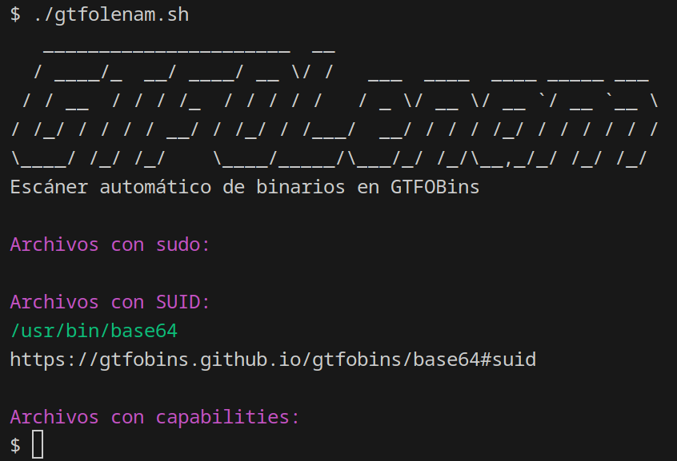

[](https://github.com/len4m/gtfolenam/)
[](https://github.com/Len4m/gtfolenam/blob/main/README.en.md)

# GTFOLenam



```bash
./gtfolenam.sh [-v] [-h] [-t=sudo,capabilities,...]
```


Personal tool for enumerating potential vectors for privilege escalation in CTFs and Linux systems.

The system binaries `sudo`, `suid`, or with `capabilities` are scanned and checked if they exist on the [GTFOBins](https://gtfobins.github.io/) website. If the binary exists, a link to the information is shown.

## Help

```
$ ./gtfolenam.sh -h
Uso: ./gtfolenam.sh [-v] [-h] [-t=tipo1,tipo2,...]

Opciones:
  -v    Modo verbose. Muestra información detallada del proceso y todos los archivos, incluso si fallan la evaluación.
  -h    Muestra esta ayuda y termina.
  -t    Tipo de escaneo a realizar, separado por comas, precedido por '='.
        Opciones válidas: sudo, suid, capabilities.
        Por defecto, se escanean todos los tipos si no se especifica.
```
## Installation

In a folder with write permissions.

```
wget https://raw.githubusercontent.com/Len4m/gtfolenam/main/gtfolenam.sh && chmod +x gtfolenam.sh
```

### Dependencies

It uses `curl` or `wget`, whichever is available on the system, to make the request to [GTFOBins](https://gtfobins.github.io/), and uses `grep` and `awk` to filter the result.

```
$ sudo apt install curl grep gawk
``` 

## Future Ideas
- [x] Filter known binaries to eliminate unnecessary requests to GTFOBins.
- [x] Remove dependency on `pup`.
- [x] Check if the `curl` or `wget` binary exists to make the request.
- [x] Check if the `grep` or `awk` binary exists to filter the request.
- [ ] Parameter to show binaries even if they are not in GTFOBins.
- [ ] Parameter for direct execution of examples.
- [ ] Parameter to show the user who acquires the privileges.
- [ ] Also check binaries inside `doas`, currently not on GTFOBins.

## Legal Disclaimer

This software is designed for personal use only and should be used exclusively in controlled and authorized environments. Using this tool on systems or networks without proper authorization may be illegal and violate security policies. The developer assumes no responsibility for damages, losses, or consequences resulting from its misuse or unauthorized use. Ensure compliance with all applicable local laws and regulations before using this tool.